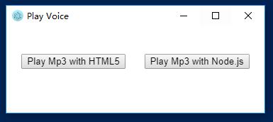

sometime app need play a voice when taking photo or scan a id card

when take a photo, use HTML5 play the voice on web page is a good idea

but if a signal from outer, main process first receive it, use child_process play voice

the command-line MP3 players is from [https://github.com/jimlawless/cmdmp3](https://github.com/jimlawless/cmdmp3)

and you can also use [mpg123](http://www.mpg123.de/)

