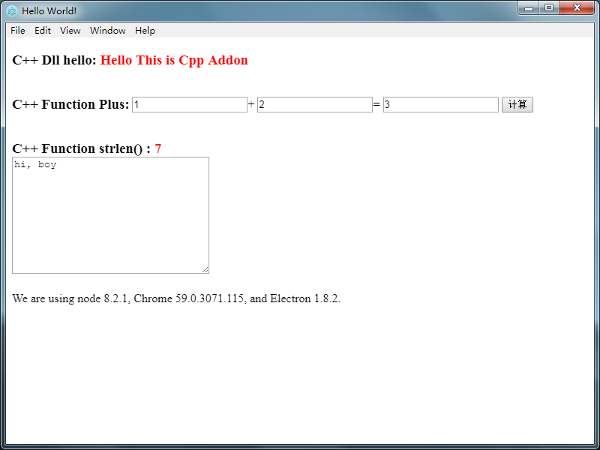

This demo from [https://github.com/wzdxy/electron-ffi-demo](https://github.com/wzdxy/electron-ffi-demo)

Node.js 32-bit can load 32-bit DLL, Node.js 64-bit can load 64-bit DLL.
32-bit DLL can running both x86 and x64, That's all

## Quick Start

```bash
yarn
yarn run rebuild-ffi
yarn run start
```



## `MyDLL.dll` Source Code

- cpp

```cpp
#include "stdafx.h"
#include "testdll.h"
#include <iostream>
using namespace std;
float Add(float plus1, float plus2)
{
	float add_result = plus1 + plus2;
	return add_result;
}

char *Hello()
{
	return "Hello This is Cpp Addon";
}

int StrLength(char * str)
{
	return strlen(str);
}
```

- h
```h
#pragma once
#ifndef TestDll_H_
#define TestDll_H_
#ifdef MYLIBDLL
#define MYLIBDLL extern "C" _declspec(dllimport) 
#else
#define MYLIBDLL extern "C" _declspec(dllexport) 
#endif
MYLIBDLL char* Hello();
MYLIBDLL float Add(float plus1, float plus2);
MYLIBDLL int StrLength(char * str);
//You can also write like this:
//extern "C" {
//_declspec(dllexport) int Add(int plus1, int plus2);
//};
#endif
```


- def

```def
LIBRARY "MyDLL"
EXPORTS
Add @1
```
